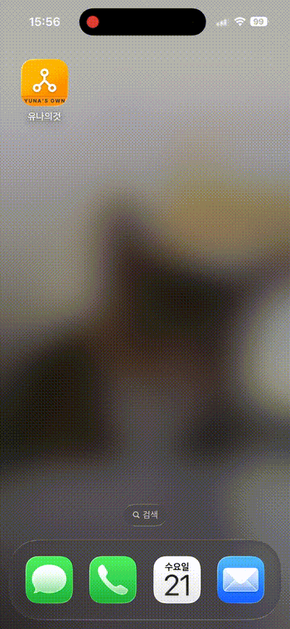

# On-Device LLM iOS Chat App (Gemma + llama.cpp)

이 프로젝트는 **llama.cpp 엔진을 이용한 Gemma 모델 온디바이스 iOS 채팅 앱** 포트폴리오용 샘플입니다.  
SwiftUI + C wrapper(`llama-wrapper`)를 이용하여 iOS에서 바로 Gemma 모델을 실행할 수 있습니다.

## Demo



---

## 주요 기능

- iOS 기기에서 Gemma 모델 기반 텍스트 생성
- 사용자/모델 메시지 구분 UI
- 비동기 처리로 실시간 메시지 스트리밍
- C wrapper 를 통한 Swift <-> llama.cpp 통신
- C wrapper 기반 인터페이스로 iOS / Android 공통 추론 레이어 설계 가능성 고려

---

## Why On-Device LLM?

- 이 프로젝트는 클라우드 API 기반 AI 앱이 아닌, **온디바이스 LLM 실행 구조**를 직접 구현하는 데 초점을 맞췄습니다.
- 네트워크 없이 동작하는 AI 앱 구조 이해
- 모바일 환경에서의 메모리 / 성능 제약 고려
- Swift <-> C 인터페이스 설계 경험
- 향후 프라이버시 중심 AI 앱 확장 가능성 검증
- C wrapper 기반 인터페이스를 통해 추론 로직을 SwiftUI 앱에 안전하게 통합하는 구조 설계


---

## TODO

- 멀티 세션 / 컨텍스트 관리 구조 개선
- 스트리밍 처리 안정화 및 메모리 관리 최적화
- UI 최적화 및 대화 히스토리 구조 개선

---

## 구조

```
├── llama-wrapper
│ ├── llama-wrapper.cpp # C ABI 기반 인터페이스 (내부 구현은 C++)
│ ├── llama-wrapper.h
├── YunaOwn
│ ├── Models/
│ │ └── LlamaState.swift # Swift 모델 상태 및 Completion 구현
│ ├── Views/
│ │ └── ContentView.swift # SwiftUI UI
│ └── llama-bridge-header.h # Swift-Bridging 헤더
├── Resources/
│ └── gemma-3-4b-it-q4_k_m.gguf # 모델 파일 (다운로드 필요)
├── .gitignore
└── README.md
```


---

## 주의사항

- 모델 파일은 GitHub에 포함하지 않음
- 시뮬레이터에서는 GPU 사용 불가 → `nGpuLayers = 0`로 자동 조정
- C 래퍼는 단일 세션 기준 설계 → 멀티 세션 사용 시 추가 구현 필요

---

## 라이선스

- 이 프로젝트의 Swift/C++ 코드는 **MIT 라이선스** 적용  
- `llama.cpp` 기반 코드는 [llama.cpp MIT 라이선스](https://github.com/ggerganov/llama.cpp/blob/master/LICENSE) 준수 필요

---
